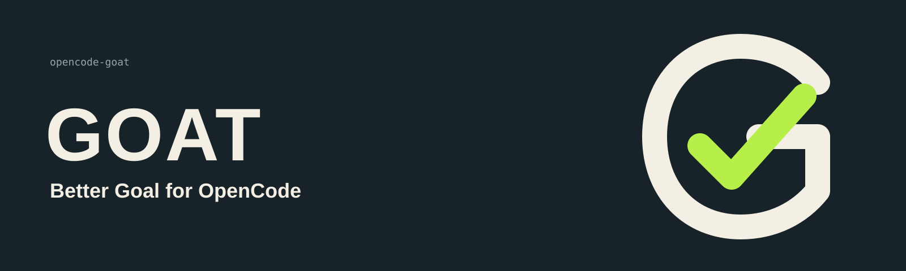
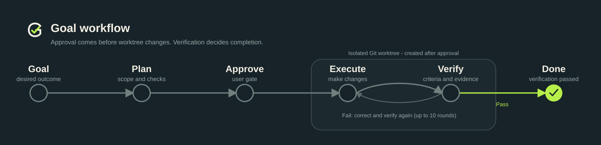

# Goat

English | [简体中文](README.zh-CN.md)



Goal operationalization, alignment, and testing for OpenCode.

This release is an alpha preview. Use it with disposable branches or
worktrees until your team has completed its own recovery and permission review.

Source and issue tracker: <https://github.com/leelele-cug/opencode-goat>

Goat turns a `/goat <intent>` command into a durable, approved Goal Contract,
executes it in an approved workspace through a dedicated Executor Session, and
independently verifies every MUST criterion with a dedicated read-only Verifier
Session.

The core idea is an evidence loop: authority moves forward only through an
exact Contract and native approval; evidence returns through an independent
verification before the Goal can be complete.

## Requirements

- OpenCode `>=1.18.15`
- Bun `1.3.14` (OpenCode supplies the runtime; this version is required for local development and smoke tests)
- Git `2.40+` and a Git worktree for every Goal

## Install

Add `opencode-goat` to your OpenCode plugin configuration:

```json
{
  "plugin": ["opencode-goat@alpha"]
}
```

The plugin is zero-configuration. `OPENCODE_GOAT_HOME` may override the data
directory (defaults to the platform data location plus `opencode-goat`).

The package is published under the `alpha` dist-tag. Pin the exact version in
production experiments after reviewing the changelog.


## Commands

```text
/goat <intent>        create a Goal and start read-only formulation
/goat                 concise one-screen status
/goat status          detailed Contract, criteria, evidence, and history
/goat pause           pause execution with a verified workspace checkpoint
/goat resume          resume, retry preparation, or reissue a rejected approval
/goat revise <change> close the current Run and return to formulation
/goat cancel          cancel and preserve all workspace changes
/goat doctor          inspect Goat schema, project, bindings, and workspace
/goat help            short usage
```



## Roles

Goat registers three fixed agents. Their capabilities are defined once in
`src/core/role-capabilities.ts` and cannot be overridden by user agent config.

| Agent | Mode | Capabilities |
| --- | --- | --- |
| `goat-formulator` | primary, root Session | read/search/webfetch/websearch, native Question, `goat_state`, `goat_contract_propose` |
| `goat-executor` | primary, child Session per Run | read/search/webfetch/websearch, edit/write/apply_patch/bash in the approved workspace, `goat_state`, `goat_evidence_record`, `goat_completion_propose`, `goat_block` |
| `goat-verifier` | subagent, child Session per attempt | read/search/webfetch/websearch, approved verification commands, `goat_state`, `goat_verifier_report` |

Goat never generates `allow` or `ask` permission rules. OpenCode's native
permission system remains the final policy layer: user global `deny` stays
`deny`, user `ask` stays `ask`, and user `allow` cannot open tools outside the
fixed role matrix.

Goat is not an OS sandbox. Executor bash remains subject to OpenCode's native
permission system and may have side effects beyond Git's visible diff. Keep
OpenCode permissions for external directories and other side-effecting tools
at `ask` or `deny`.

## Safety properties

- No target-project write before an exact Contract revision is approved.
- Every new Run activates only from a clean, preflight-checked workspace.
- Executor and Verifier child Sessions are identity-bound (project, workspace,
  parent, directory, agent, model, metadata) and stale Sessions are rejected.
- Completion requires the final workspace state to be fully explained by the
  dedicated Executor Session diff; unexplained changes block the Goal.
- All durable state lives in a single SQLite database (Schema v8, no
  migrations). Version mismatches fail startup without modification.
- The database contains source requests, Contracts, evidence references, audit
  data, and workspace patches. Protect `OPENCODE_GOAT_HOME` and back it up as
  appropriate; incompatible databases must be moved aside manually.
- A rejected or closed approval Question blocks the Goal with an actionable
  message; `/goat resume` creates a new approval generation on the same
  Contract revision.
- Verification runs in batches of at most ten rounds. Every non-passing round
  continues automatically; after round ten, `/goat resume` starts another
  batch.
- Goat preserves native worktrees after completion, cancellation, and revision.
  It never commits, merges, pushes, or removes a user's worktree automatically.

## Development

```text
bun run check        typecheck + tests
bun run coverage:check coverage-gated tests
bun run build        clean build to dist/
bun test             unit/integration tests
bun run pack:smoke   real tarball install and export verification
bun run smoke:opencode   authenticated live smoke (defaults to opencode/deepseek-v4-flash; override with OPENCODE_SMOKE_MODEL)
```

## License

MIT
