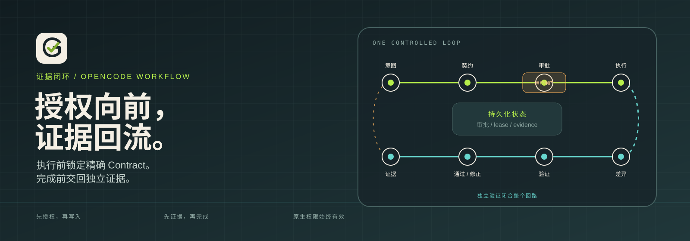
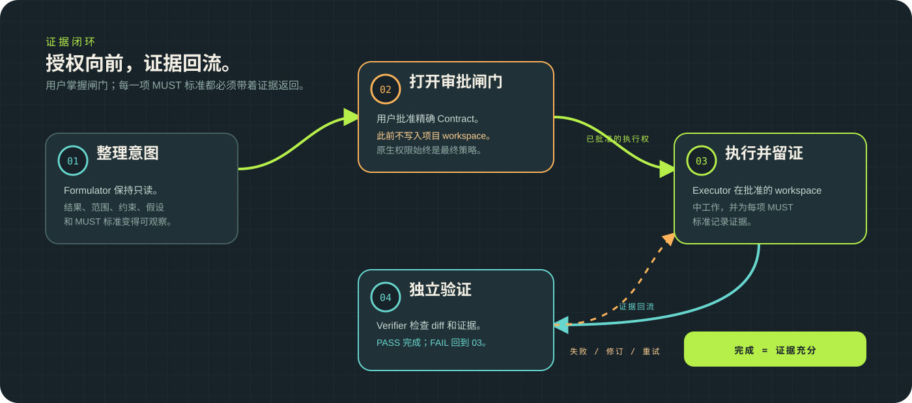

# Goat

[English](README.md) | 简体中文



面向 OpenCode 的目标操作化、对齐与测试插件。

这是 alpha 预览版本。在完成团队自己的恢复与权限审查前，请只在可丢弃的
分支或 worktree 中使用。

Goat 将 `/goat <意图>` 转换为持久化、经用户批准的 Goal Contract（目标契约），
在批准的 workspace 中通过专用 Executor Session 执行，并通过独立的 Verifier
Session 验证每一项 MUST 标准。

核心设计是证据闭环：执行权只能沿着精确 Contract 和原生审批向前流动；
完成前，证据必须经过独立验证回流。

## 要求

- OpenCode `>=1.18.15`
- Bun `1.3.14`（OpenCode 提供运行时；本版本用于本地开发和 smoke test）
- Git `2.40+`，每个 Goal 使用独立 Git worktree

## 安装

在 OpenCode 插件配置中加入：

```json
{
  "plugin": ["opencode-goat@alpha"]
}
```

插件无需额外配置。可使用 `OPENCODE_GOAT_HOME` 覆盖数据目录；默认目录为平台
数据目录下的 `opencode-goat`。

生产实验请先阅读 CHANGELOG，再固定使用具体版本。当前预览包使用 `alpha`
dist-tag。

## 命令

```text
/goat <意图>          创建 Goal 并启动只读 Contract 形成
/goat                 显示一屏简要状态
/goat status          显示 Contract、标准、证据和历史
/goat pause           暂停执行并保存 workspace checkpoint
/goat resume          恢复执行、重试准备或重新发起审批
/goat revise <修改>   关闭当前 Run，返回 Contract 形成
/goat cancel          取消 Goal，并保留全部 workspace 修改
/goat doctor          检查 Goat schema、项目、绑定和 workspace
/goat help            显示简短帮助
```

## 工作流



1. Formulator 将用户意图整理为可观察的 outcome、范围、约束、假设和验证计划。
2. 用户通过原生 Question 审批精确 Contract。
3. Executor 在批准的 workspace 和子 Session 中执行，不得越过目录边界。
4. Verifier 独立检查每个 criterion；只有全部 MUST 通过才完成 Goal。

验证按批次执行，每批最多十轮。第 1 到第 9 轮失败会自动返回 Executor 修复；
第 10 轮仍未通过时进入 BLOCKED。`/goat resume` 才会开启下一批。

## 角色

Goat 注册三个固定 Agent。角色能力集中定义在
`src/core/role-capabilities.ts`，不能通过用户 Agent 配置扩大。

| Agent | 模式 | 能力 |
| --- | --- | --- |
| `goat-formulator` | primary，root Session | read/search/webfetch/websearch、原生 Question、Contract 工具 |
| `goat-executor` | primary，每个 Run 一个 child Session | approved workspace 中的 read/edit/write/apply_patch/bash、证据和完成工具 |
| `goat-verifier` | subagent，每轮一个 child Session | read/search/webfetch/websearch、批准的 command、验证报告工具 |

Goat 不生成 `allow` 或 `ask` 权限规则。OpenCode 原生权限始终是最终策略层：
用户全局 `deny` 仍为 `deny`，`ask` 仍为 `ask`；Goat 不能通过 `allow` 打开角色
矩阵以外的工具。

Goat 不是 OS sandbox。Executor bash 仍受 OpenCode 原生权限控制，并可能产生 Git
不可见的外部副作用。对外部目录和其他有副作用工具，请保持 `ask` 或 `deny`。

## 安全属性

- 精确 Contract revision 获得批准前，不向目标 workspace 写入。
- 每个 Run 只从已完成 preflight 的 workspace 激活。
- Executor 和 Verifier child Session 绑定 project、workspace、parent、目录、Agent、model 和 metadata；旧 Session 会被拒绝。
- completion 要求最终 workspace 能被 Executor Session diff 完整解释；无法解释的修改会阻断 Goal。
- 所有持久状态保存在单一 SQLite 数据库中（Schema v8，不提供迁移）。版本不匹配时不修改数据库并停止启动。
- 数据库包含 source request、Contract、证据引用、审计记录和 workspace 状态。请保护 `OPENCODE_GOAT_HOME` 并按需备份。
- 被拒绝或关闭的审批 Question 会形成可操作 blocker；`/goat resume` 会在同一 Contract revision 上创建新的 approval generation。
- Goal、Run、Session、lease 和 dispatch 都由持久状态及 fencing token 保护。
- Goat 在完成、取消、修订和失败后保留 worktree；不会自动 commit、merge、push 或删除 worktree。

## 开发

```text
bun run check             类型检查 + 测试
bun run coverage:check    覆盖率门禁
bun run build             构建 dist/
bun test                  单元和集成测试
bun run pack:smoke        真实 tarball 安装与 export 检查
bun run smoke:opencode    authenticated smoke，默认使用 opencode/deepseek-v4-flash-free
```

## 许可证

MIT
